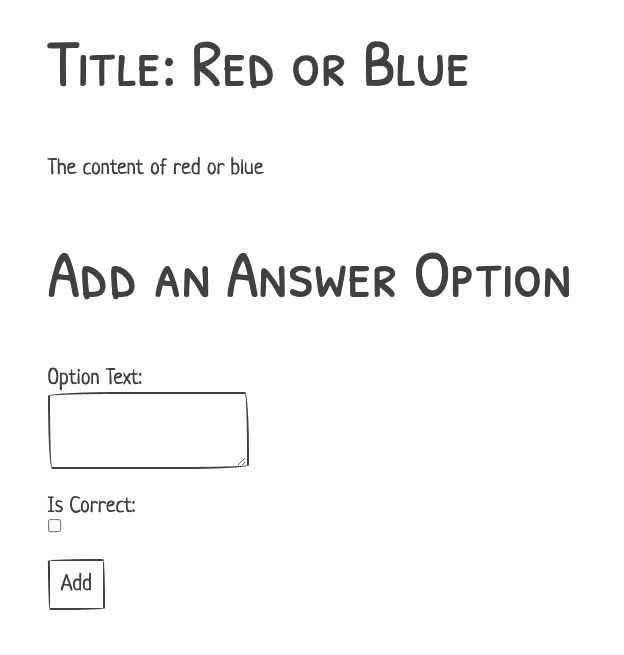
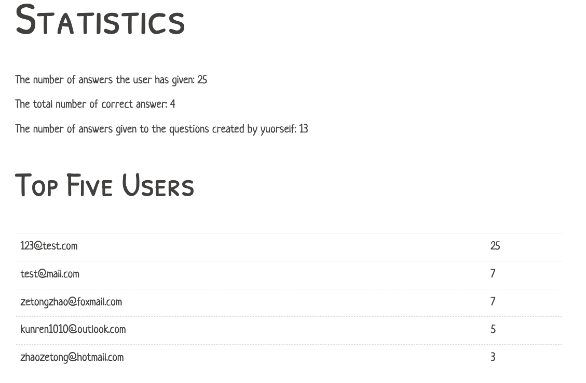

# Online Address

The online location of the application is : https://question-application-wsd.herokuapp.com/ (Invalid now since Heroku stopped the free service).

The application can instead be run locally with my database configuration our customized one.

# Login

You can login the application with the credentials: `123@test.com` and `123456` or just register a new account

# Usage

After Login:

- Click the `Question` button on the navigation bar to create a new question.

   

   After creating the question, click the question name to create answer option for the question. 

   

   To delete the question, first delete all the answer options, then a delete button will be displyed to delete the question.

   

- Click the `Quiz` button to get a random question to answer and make the choice

- Click the `Statistic` button to check the current statistics.

  

- APIs. Make GET requests to the path `/api/questions/random` can get a randomly questions as an JSON document. Make POST requests to the path `/api/questions/answer` with a JSON document that contains the id of the question and the id of the answer option are processed by the server, verifying whether the response was correct or not.

# Testing

Run the tests with the command `deno test --allow-all --unstable` in the root directory of the application. Before performing testing, please run the application first.

# Database

To run the application locally, you should configure the database in the file `database.js` under the `database` folder. (Just replace the one I used.)

There should be four tables in the database:

~~~sql
CREATE TABLE users (
  id SERIAL PRIMARY KEY,
  email VARCHAR(255) UNIQUE,
  password CHAR(60)
);

CREATE TABLE questions (
  id SERIAL PRIMARY KEY,
  user_id INTEGER REFERENCES users(id),
  title VARCHAR(256) NOT NULL,
  question_text TEXT NOT NULL
);

CREATE TABLE question_answer_options (
  id SERIAL PRIMARY KEY,
  question_id INTEGER REFERENCES questions(id),
  option_text TEXT NOT NULL,
  is_correct BOOLEAN DEFAULT false
);

CREATE TABLE question_answers (
  id SERIAL PRIMARY KEY,
  user_id INTEGER REFERENCES users(id),
  question_id INTEGER REFERENCES questions(id),
  question_answer_option_id INTEGER REFERENCES question_answer_options(id),
  correct BOOLEAN DEFAULT false
);

CREATE UNIQUE INDEX ON users((lower(email)));
~~~

# Running Locally

If you want to run the application locally, use the command after configuring the databases:

`deno run --allow-all --unstable run-locally.js`

